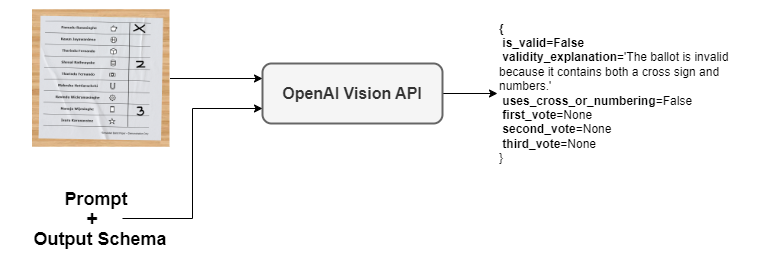
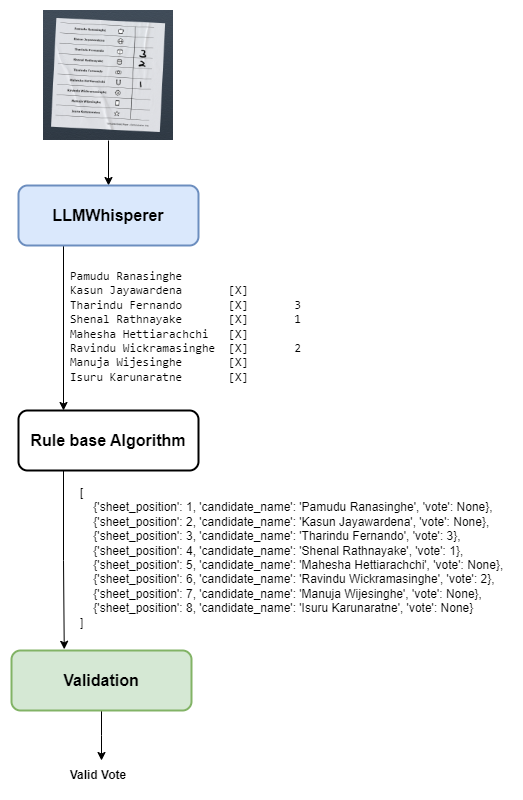
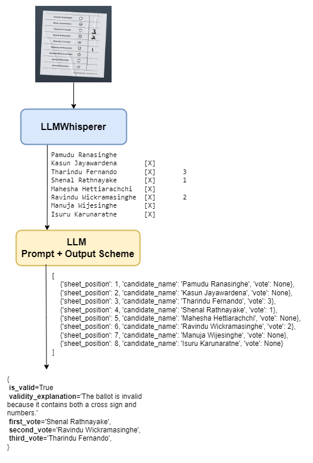
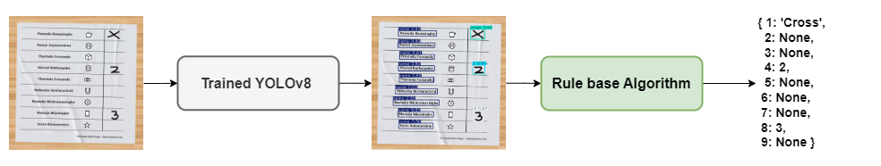

# Automated Election Vote Counting
# -- UNDER CONSTRUCTION ---
## -- UNDER CONSTRUCTION ---

Detailed Explanation
[Medium Article](https://medium.com/@pamudu1111/automated-election-vote-counting-7b89900f7333)

### 1. Using ChatGPT Vision API to Process Ballot Papers

### 2. Process the Layout with OCR

### 3. Using Object Detection — YOLO

### 4. Vote Extraction Using Computer Vision

3. **Preprocess Image**
   - Convert to grayscale.
   - Apply Gaussian blur.
   - Perform edge detection using Canny.

Detect Largest Contour
Apply perspective transformation to align the document.
Detect Horizontal Lines
   - Find horizontal lines in the image to separate candidate region .

Template Matching for Each Section
   - Compare each sub-image with the templates.
   - Identify the matching symbol for each section.

Record the identified symbols and their positions in a dictionary.

-- UNDER CONSTRUCTION ---
