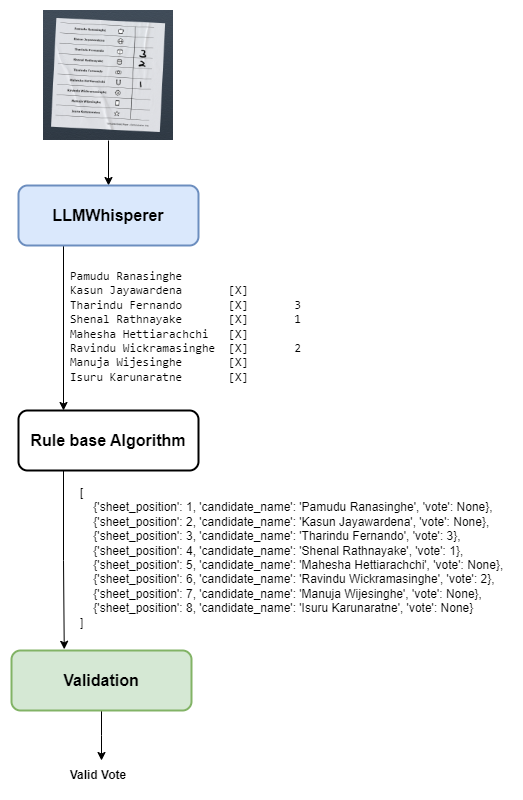
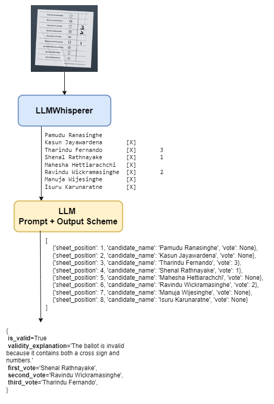

# Automated Election Vote Counting

**Detailed Explanation of Vote Counting Methods**
[Medium Article](https://medium.com/@pamudu1111/automated-election-vote-counting-7b89900f7333)

### 1. Using ChatGPT Vision API to Process Ballot Papers

OpenAI Vision API analyzes images of ballot papers, interprets the votes, and returns structured data.

### 2. Process the Layout with OCR
<table>
  <tr>
    <td>
      
    </td>
    <td>
      
    </td>
  </tr>
</table>

Layout extraction technique followed by a rule-based/LLM approach to process and extract the details from the structured OCR text.

### 3. Using Object Detection — YOLO

YOLO object detection model to extract details from the ballot paper.

### 4. Vote Extraction Using Computer Vision

Pure computer vision-based method, using edge detection, contour detection, kernel processing, and template matching.

---

Feel free to try this and come up with your own methods for automating vote counting.

I’d love to hear your new ideas!. Feel free to reach out if you have any questions.

